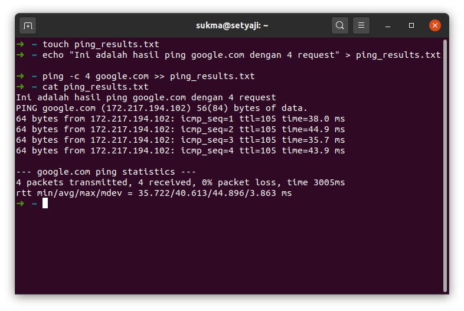

# Studi Kasus: Memasukkan Teks

# Requirement
- Sistem operasi berbasis UNIX/Linux
- Akses ke shell

# Step
1. Buka terminal
2. Buat sebuah file kosong dengan perintah
```shell
touch ping_results.txt
```
3. Tambahkan teks ke file `ping_results.txt`
```shell
echo "Ini adalah hasil ping google.com dengan 4 request" > ping_results.txt
```
4. Kemudian lakukan ping ke google.com sebanyak 4 request, lalu simpan hasilnya di ping_results.txt
```shell
ping -c 4 google.com >> ping_results.txt
```
5. Tampilkan hasil ping yang disimpan dalam file teks
```shell
cat ping_results.txt
```
Maka akan didapatkan hasil seperti berikut

# Screenshot
